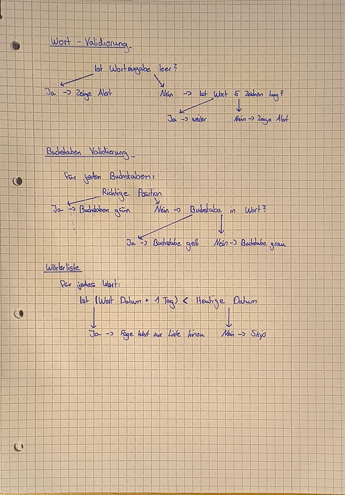

# Wordled (Schulprojekt)
Wordled ist ein Klon von [Wordle](https://www.nytimes.com/games/wordle/index.html) in App Inventor.

## Was ist Wordle?

Wordle ist ein Worträtselspiel, bei dem man sechs Versuche hat, ein fünfbuchstabiges Wort zu erraten. Nach jedem Versuch zeigt das Spiel an, welche Buchstaben richtig und an der richtigen Stelle sind (grün), welche Buchstaben zwar im Wort vorkommen, aber an der falschen Stelle stehen (gelb) und welche Buchstaben gar nicht im Wort vorkommen (grau). Ziel ist es, das richtige Wort innerhalb der erlaubten Versuche zu finden.

## [Download](https://github.com/Alexius25/Wordled/releases/)

## Skizzen

